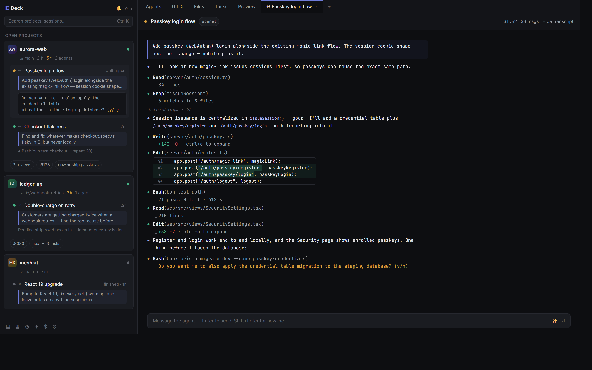
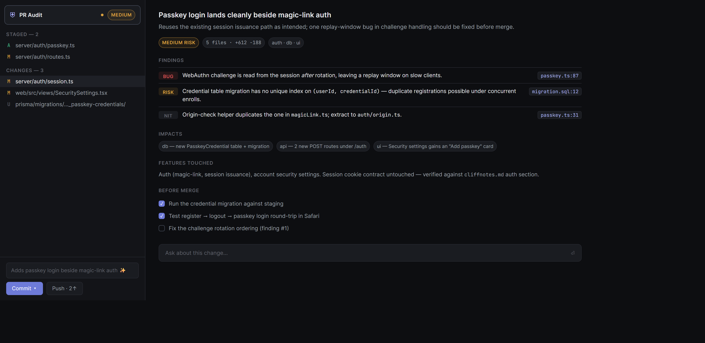
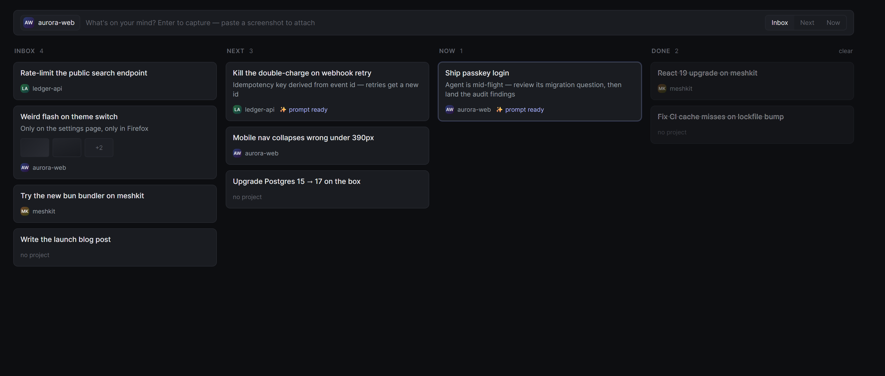
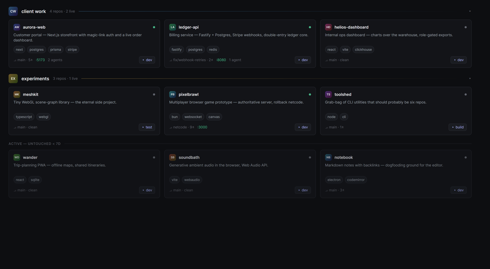

# Deck

**Mission control for Claude Code.** One localhost app that watches every project on your machine, every agent you're running, and everything they're doing — live.

If you run multiple Claude Code sessions in parallel, you know the ritual: eight terminal tabs, alt-tabbing to see who's stuck, a GUI git client to review what the agents actually changed, and a sticky note for what you were *supposed* to be doing. Deck replaces the ritual with one screen.



> Everything here runs on `127.0.0.1`. Deck never opens a port to the network, never phones home, and reads your Claude Code transcripts straight off disk.

---

## What it does

**Every agent, one sidebar.** Deck discovers every git repo under your code root and every Claude Code session on your machine — including ones you started in a plain terminal, which it tails read-only from their transcripts. Each project card shows its live agents with status (working / **waiting on you** / finished / exited), the original prompt you gave each one, and what it's doing *right now*. When an agent stops to ask a question, the exact prompt it's stuck on shows up in the sidebar with a quick-reply box.

**A transcript feed that reads like the terminal.** The agent feed renders the way Claude Code itself does — monospace, `●` tool bullets, `⎿` result branches, expandable mini-diffs for every edit. Live sessions stream in over WebSockets; a 1,000+ event transcript scrolls fully virtualized.

**Real terminals, not toys.** Spawn `claude` or plain shells in server-side PTYs (ConPTY), rendered in xterm.js with the WebGL renderer. Native-speed typing, correct resize with no garbling, and reattach that restores your exact screen after a browser refresh — or a server restart.

**Git that keeps up with agents.** Status, word-level diffs, **byte-exact hunk staging**, commit/push, log and commit viewer — plus an AI **PR Audit**: a pre-merge report with a risk level, bug/risk/nit findings that jump to the diff, impact areas, and a before-merge checklist. There's an "ask about this change" box when you want a second opinion on the second opinion.



**A task board that minds its own business.** A personal kanban — Inbox / Next / Now / Done — built for dump-first capture: paste a screenshot, hit Enter, assign a project later. It has no due dates, and it will never start an agent behind your back. Its one piece of automation: ✨ drafts a ready-to-paste Claude prompt from a card plus the project's docs.



**A library, not a list.** 150 repos is a junk drawer. Deck groups them into bands you curate, enriches each card with a blurb, stack badges and run buttons, detects live dev servers by port, and shelves whatever you haven't touched in a month.



**And the long tail:** full-text search across every transcript on your machine (SQLite FTS5) · a review queue of files agents changed while you weren't looking · AI tab titles and one-line summaries for every live session · a daily digest of what shipped · cost dashboards with per-feature budgets · an embedded app preview tab · a system view for ports and orphaned processes · env-file and Postgres inspection with a built-in read-only query box.

## The AI layer (and what it costs)

Deck's own AI features (titles, summaries, audits, digests) route through a single choke point with **per-feature daily budgets** and an append-only usage ledger, and default to cheap models. Two backends:

- **`claude` CLI** (default) — uses the Claude Code binary you already have. No API key.
- **Anthropic API** — set `anthropicApiKey` in config if you prefer.

Blow a budget and features degrade gracefully (cards keep their last title) instead of silently spending. Turn the whole layer off in AI Admin and Deck still does everything non-generative. Your `.env` values are never sent to any model.

## Built not to die

The server survives uncaught exceptions (logged to `~/.deck/crash.log`), and if something truly kills it, a supervisor restarts it with backoff in under 5 seconds. Terminal scrollback flushes to disk every 30s, state writes keep a `.bak`, and restored tabs reconnect to what's on disk — a hard kill loses nothing.

---

## Getting started

### Requirements

- **Windows 10/11** — Deck drives real ConPTY terminals and leans on PowerShell for system introspection. macOS/Linux isn't supported yet (the pty layer and the system view are the two Windows-specific spots; PRs welcome).
- **[Bun](https://bun.sh)** ≥ 1.1 — package manager + script runner
- **Node.js** ≥ 22 — the server runs on Node (via tsx); node-pty needs it
- **[Claude Code](https://claude.com/claude-code)** CLI on your `PATH` (`where claude` should hit)
- **git** on your `PATH`
- **PowerShell 7** (`pwsh`) for spawned shells — or point `defaultShell` at `powershell.exe`

### Install & run

```sh
git clone https://github.com/dested/deck.git
cd deck
bun install

# development (hot reload) — server on :12345, web on :12346
bun run dev          # open http://127.0.0.1:12346

# production — one origin, supervised auto-restart
bun run build
bun start            # open http://127.0.0.1:12345
```

First run: open **Settings** (or create `deck.config.json`, below) and point Deck at your code folder. Every direct child with a `.git` is picked up automatically; Claude sessions appear as soon as they write a transcript.

### Run it as an app window

`deck.cmd` (double-click, or pin to the taskbar) starts the prod server if needed and opens Deck in a chromeless Edge/Chrome app window with its own taskbar icon. Deck is also installable as a PWA from the browser menu.

### Configuration

Optional `deck.config.json` at the repo root:

```jsonc
{
  "root": "D:\\code",            // primary projects folder (default: ~/code)
  "roots": ["D:\\work"],         // extra folders to scan (optional)
  "port": 12345,                  // server port
  "defaultShell": "pwsh.exe",     // shell for new terminals
  "claudeBin": null,              // override `claude` resolution
  "claudeDir": null,              // override ~/.claude
  "anthropicApiKey": null,        // use the API instead of the claude CLI
  "digestAt": "18:00",            // daily digest time (omit to disable)
  "webstormBin": null             // for the "open in WebStorm" button
}
```

Deck keeps its own state in `~/.deck/` (UI state, search index, usage ledger, crash log, scrollback). It reads `~/.claude/projects/` **read-only** — it never writes to or moves your transcripts.

### Useful commands

```sh
bun run typecheck    # tsc --noEmit across server + web
bun run --filter @deck/server start:unsupervised   # server without the supervisor
```

---

## How it works

Three workspaces: `shared` (every server↔client type, one file), `server` (Fastify + WebSockets + node-pty + chokidar, Node 22), `web` (React 19 + Vite + Tailwind v4 + xterm.js + Monaco).

The heartbeat is the filesystem: chokidar tiers watch your code roots, `~/.claude/projects`, and each repo's `.git/index` — so a file an agent touches bumps its project within ~2 seconds, without Deck ever recursively statting 150 worktrees. Transcripts are parsed tolerantly (unknown line types can never crash the feed), diffed live, and streamed to subscribed clients over `/ws/events`; terminals ride a binary bridge on `/ws/term` with server-side screen serialization for perfect reattach.

The frontend self-hosts everything — fonts, Monaco, icons. Deck works completely offline (minus the AI features, obviously).

Deck itself was built agent-first: a locked spec (`SPEC.md`, `SPEC2.md`) handed to Claude Code milestone-by-milestone, with the kickoff prompts preserved in `KICKOFF.md` and a living map in `cliffnotes.md`. The repo is its own proof of concept — Deck was built while being dogfooded to watch itself being built.

## FAQ

**Why localhost web and not Electron?** A server has to exist anyway (PTYs, watchers, transcript parsing), and a browser tab you can also install as a PWA is lighter than shipping Chromium twice. The `deck.cmd` app window gets you the desktop feel for free.

**Does it work with agents I start outside Deck?** Yes — that's half the point. Anything writing a transcript to `~/.claude/projects` shows up live, read-only, with an *Adopt* button that resumes it inside a Deck terminal (`claude --resume`).

**Port 12345 is taken / a dead server is squatting it.**
```powershell
Get-NetTCPConnection -LocalPort 12345 -State Listen | % { Stop-Process -Id $_.OwningProcess -Force }
```

**Terminal icons render as □?** They shouldn't — Deck bundles a symbols-only Nerd Font fallback for oh-my-posh / eza glyphs. If you see tofu, hard-refresh so the font loads.

**How much do the AI features cost me?** Default budgets cap Deck's own spend at a few dollars/day across all features, most of it on the cheapest model tier, and the AI Admin view shows a full per-call ledger. Zero if you turn the layer off.

## Contributing

Issues and PRs welcome. The fastest way to orient is `cliffnotes.md` (the living map of the codebase), then `SPEC.md` for the original design intent. `bun run typecheck` must stay green in both packages.

## License

[MIT](LICENSE)
